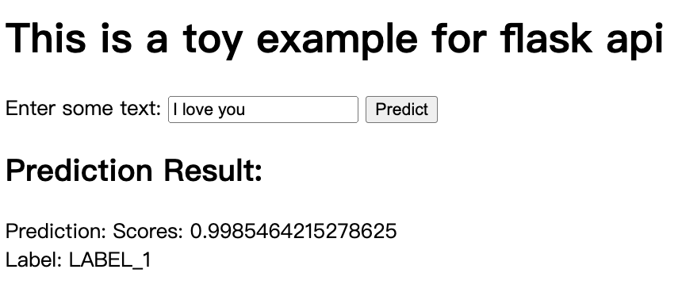

## 1. Model

We employed the huggingface pipeline to directly incorporate a pre-trained baseline model for the purpose of performing text classification.

See the details: https://huggingface.co/docs/transformers/tasks/sequence_classification

## 2. Service

As a preliminary implementation for the Flask API, we combined HTML and Python code within the same file. This basic setup enables users to interact with a simple text-based bot by inputting text, which is then forwarded to the model for inference.

## 3. Launch

Launch the application service as a model endpoint

```bash
python app.py
```

Now, you can open your browser at `http://127.0.0.1:5000`, and send some messages.

Also, you can use the following scripts to access the server with command line:

```bash
curl -X POST -H "Content-Type: application/json" -d '{"key":"value", "input": "YOUR_INPUT_TEXT"}' http://127.0.0.1:5000/predict
```

## 4. Result

The following is the final outcome of our implementation. It constitutes a rudimentary service operating on the local host. Moving forward, you can collaborate with a frontend developer to establish a local server on a single machine. The frontend developer will then be able to activate your model through the execution of scripts.

<p align="center">
    </img>

</p>


btw: `uwsgi.ini` will be introduced at `02_load_balancer_for_model_endpoint/`
