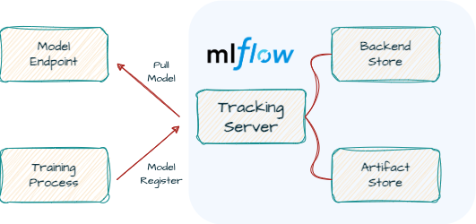
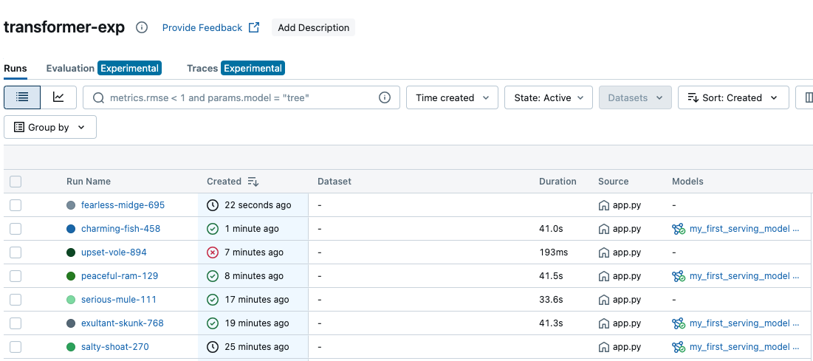

# Services Overview

Our initial service framework is functional, but for production, we need to incorporate **model monitoring**, **version control**, and a **centralized model management system**. 

The current practice of deploying a new model instance on each node is not scalable. A more efficient approach would be to train the model once and then deploy it to a centralized serving node. This centralized node would be responsible for managing all trained models.

<p align="center">
    </img>
</p>

By leveraging **MLflow**, we can effortlessly manage our models. This means we can directly **pull specific versions of models to our model endpoints** for serving (as shown in the figure). 

Furthermore, this framework facilitates model iteration and subsequent automation processes such as deployment.

## Build MLflow Services - Simply

Install `mlflow` package
```bash
pip install mlflow
```

We now can quick launch a mlflow server by the following command:
```bash
mlflow server --host 0.0.0.0 --port 5001
```

See command the details: https://mlflow.org/docs/latest/cli.html

## Build MLflow Services - Docker Compose

Through the tours of `03_docker_compose_services`, we know how to construct services by `docker-compose`. Thus, instead of building all components in the same container (simply demo), we are going to use `docker-compose` to build the `mlflow` architecture above.

```
docker-compose up --build
```
Finally, you can see the **MLflow** Server that we have set up as follows. Of course, since no experiments have been conducted yet, there will be no data displayed. You can quickly create a toy experiment through the [Quicktour](#quicktour).

<p align="center">
    </img>
</p>

# Quicktour

## Experiments Record

We will use a simple example of modeling with `sklearn`. The actual model data, parameters, results, and other information have successfully interacted with our database and services.

```python
import mlflow
import mlflow.sklearn
from mlflow.models import infer_signature
from sklearn.datasets import load_diabetes
from sklearn.ensemble import RandomForestRegressor
from sklearn.model_selection import train_test_split

# set the experiment id
mlflow.set_tracking_uri("http://localhost:5001")
mlflow.set_experiment(experiment_id="0")

mlflow.autolog()
db = load_diabetes()

X_train, X_test, y_train, y_test = train_test_split(db.data, db.target)

# Create and train models. Auto-log in mlflow.
rf = RandomForestRegressor(n_estimators=100, max_depth=6, max_features=3)
rf.fit(X_train, y_train)
```

By logging in to `http://localhost:5001,` you can access the operation interface of the `mlflow` service we have established. The backend database can also be further verified for data integrity through methods such as `docker exec`.

## Model Registry

In a production environment, we may experiment with multiple models simultaneously and ultimately deploy the best model. Therefore, utilizing the `Model Registry` allows for effective management of model versions.

```python
from mlflow.tracking import MlflowClient

client = MlflowClient("http://localhost:5001")
model_name = "MyFirstModel"

# Register the model
mlflow.sklearn.log_model(
    sk_model=rf,
    artifact_path="sklearn-model",
    registered_model_name=model_name,
)

# Alias a model to classify model status
version = client.search_model_versions(f"name='{model_name}'")[0].version
client.set_registered_model_alias(model_name, "Production", version)
```

## Load Registry Model

Finally, we can easily load the model and ensure that the version loaded each time is the `Production` version through the use of aliases. 

```python
my_model = mlflow.pyfunc.load_model(model_uri=f"models:/{model_name}@Production")
predictions = my_model.predict(X_test)
```

Users can customize experiments themselves, promoting the best model to the `Production` version, and so on.


