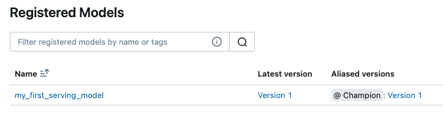
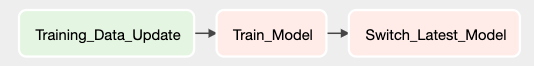
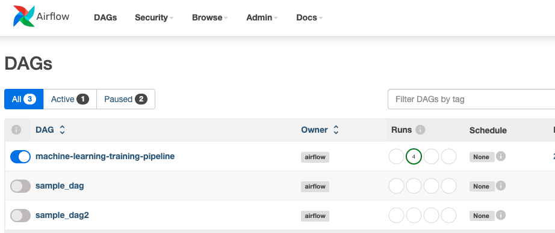

Finally, we will use the previously mentioned **Nginx** and model endpoint as the model serving endpoint, and the **MLflow** server as the model version control and experiment monitoring endpoint. 

We will later add the **model training pipeline as an endpoint** for automating the training process. Additionally, we will manage the workflows of each node through **Airflow**, forming a complete automated platform for MLOps as shown below:

<p align="center">
    </img>
</p>

Hereafter, I will explain how to compose the aforementioned ML framework using five main components.

## 1. MLflow Server

In the first step, we will set up an **MLflow** Server as the foundation for storing the models for the entire model serving process.

Similar to `04_model_tracking_and_monitoring`, we will use a comparable `docker-compose` configuration to set up the **MLflow** service.

It is worth mentioning that this is the first service we establish; therefore, to ensure smooth communication with subsequent services, the network settings of other services will be configured to match this service.

By default, `docker-compose` uses the name `{PRJT_NAME}_default` for the default network, but in this instance, it will be `mlflow_server_default`.

## 2. Training Endpoint

By packaging the training pipeline into an **API** format, it will facilitate the automation of the training process in the future (if there are multiple machines, **GPU** resources can be assigned to this endpoint).

### Set Environment

Before setting up this service, please ensure that there is a `./training_endpoint/.env` file in the folder. Edit it as follows:

```yaml
SLACK_URL = "YOUR_SLACK_WEBHOOK_URL" # If there is no webhook, leave it empty is ok.
HUGGINGFACE_TOKEN = "YOUR_HUGGINGFACE_TOKNE" # huggingface access token
```

The main settings include the message link for **training results (optional)** and the **Hugging Face access token (required)**.

### Training Pipeline

This example primarily demonstrates how to train a **text classification model** with **huggingface framework**. However, under the current topic, we will not delve deeply into model training but will instead focus more on service establishment.

You can find the complete training pipeline in `./training_endpoint/train.py`, while `./training_endpoint/model.py` contains the relevant training configurations from the **Huggingface** documentation [here](https://huggingface.co/docs/transformers/tasks/sequence_classification).

It is worth mentioning that we have built this training pipeline into an **API** and deployed the service using `docker-compose`. The specially configured **docker-compose.yaml** file is as follows:

```yaml
networks:
    - your_network
deploy:
    resources:
        reservations:
            devices:
                - capabilities: [gpu]
```

To enable **NVIDIA** support, the following configuration is needed in the **docker-compose.yaml** file to declare hardware devices and configure the **network** to the same area as **MLflow**. This way, effective communication with the **MLflow** server can be established.

<p align="center">
    </img>
</p>

Upon successful model training, we will deploy the model using **MLflow** and compare it with the current best model **(Champion)**. If its performance is better, we will change the **Champion**.

*Note: For the purpose of a simple demo, we will not perform any comparisons. Users can modify this as needed.*

## 3. Training Database

To recap, our service aims to automatically trigger the training process when new data is added and seamlessly switch to the latest version of the model as a service. 

**Thus, this phase primarily involves setting up our training database and writing the Trigger into the internal database.** When the **Trigger** is activated, we plan to invoke the **Airflow** service to manage the entire workflow, which is look like:

<p align="center">
    </img>
</p>

For more details, please refer to the `./db` folder.

As for the **Trigger** settings, we will write them into the DB using Python. While it may be more practical for users to preconfigure the **DB Table Schema** and write the Trigger when initializing the DB. 

But in this case, we want to avoid hardcoding the **Schema** in advance. Therefore, **the Trigger will be written only when the data is being imported into the DB**. For reference, you can look at `./training_endpoint/train.py`.

## 4. Model Endpoint

In terms of the model service, similar to `../03_docker_compose_services`, our connection method has not undergone significant changes. The only thing that needs to be discussed is we have added a simple function for switching between different model versions:

```python
try:
    model_uri = f"models:/{SAMPLE_MODEL_NAME}@Champion"
    model = mlflow.transformers.load_model(model_uri)
    logging.info("Change Model Success!")
    return "Success"
except Exception as e:
    logging.info(e)
    model = lambda _: [{"label": "model not found", "score": -1}]
    return "Failed"
```

By using `alias=Champion`, we can switch to the best experimental model each time. The decision of when to switch models can be made independently; in this case, we manage this through **Airflow**. When the `best version of the model is released`, we proceed with switching the model.

## 5. Airflow

Finally, we will set up an **Airflow** platform to manage the entire workflow. Use `http://localhost:8080`, and enter the username and password as `admin` and `admin`, then you will see the **Airflow** platform as shown below. as shown below:

<p align="center">
    </img>
</p>

Note that you need to enable the `machine-learning-training-pipeline` DAG in order for the entire workflow to run properly. This workflow can refer to `./airflow/dags/ml_pipeline.py`. Its main function is to interact with the Flask API we have set up.

**Airflow** is typically a **scheduling tool**, but it also supports **triggering DAGs via API**. To enable this functionality, you need to configure the settings in file `airflow.cfg`. We made the following changes:

```yaml
[api]
enable_experimental_api = True
auth_backends = airflow.api.auth.backend.basic_auth
```

You can use file `./manually_trigger.py` to test whether the API can be triggered successfully.

# Quickstart 

We have set up individual services in different files and connected them through an internal network. You can find the details in the `docker-compose.yaml` file in each folder. To quickly start up, you can use the following command:

```bash
sh launch.sh
```

If you can successfully connect to the MLflow Server and Airflow Server, the services will run smoothly.

- **MLflow Server: http://localhost:5001**
- **Airflow Server: http://localhost:8080**

When starting the services, remember to **first enable the `machine-learning-training-pipeline` DAG** and run `./manually_trigger.py` once to successfully establish the DB service. 

This way, when additional data is added later, the entire workflow will be integrated by **Airflow**. For manual testing, you can use `./database_trigger.py`. This file simulates the addition of data to the database. If it successfully triggers the DAG, it indicates that everything is working correctly!