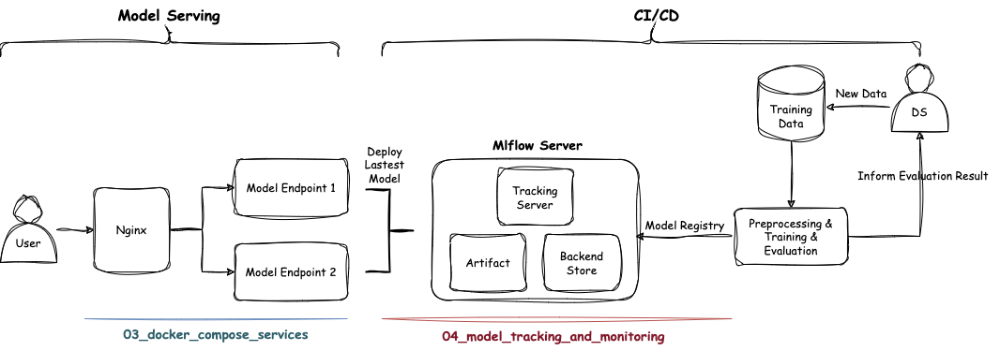

# Machine-Learning-Model-Serving

To bridge the gap between model development and application in machine learning, it's crucial to consider effective deployment strategies.

This article will concentrate on deploying machine learning models as services using **Flask API, Nginx, WSGI**, while also addressing key challenges and considerations commonly encountered in production environments.

Through a tour of **5 topics**, we will build a service for a toy **MLOps architecture**, as shown below:

    </img>

## Services Integration

### Flask API & Nginx & WSGI

### MLflow

**MLflow** is one of the most important services for tracking models, experiments, and more during the training process. 

Therefore, during the learning process, we will manually set up the **MLflow** service, as well as create a **custom backend database** and **model storage**. The schematic diagram is as follows:

### Airflow

