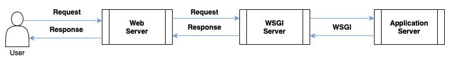

The Flask API, while suitable for many use cases, may exhibit performance bottlenecks under high traffic loads. To address this limitation and construct a more robust web server, we propose incorporating **Nginx** and **WSGI**. By positioning Nginx as a reverse proxy in front of our existing application server (model endpoint), we can distribute incoming traffic more efficiently and improve overall system performance.

<p align="center">
    </img>
</p>

Our next step, following the establishment of these fundamental concepts, is to implement a proxy layer as an intermediary for our application server.


### 1. System Setup

```bash
pip install uwsgi # use conda install uwsgi if pip install error
apt install nginx
```

### 2. Setting Configs

#### uWSGI

The file is already set at 01_build_model_endpoint_by_flask.

```
[uwsgi]
wsgi-file = app.py   
callable = app       
socket = :5001  
processes = 4
threads = 2
master = true
chmod-socket = 666
vacuum = true        
die-on-term = true
```

By these settings, we instruct the uwsgi package to spawn a process that serves the Python application defined in `app.py`. The application object is referenced within app.py as `app`. The uwsgi socket at `/app/socket/uwsgi.sock` will be used for communication with this application.

Note: `/app/socket/uwsgi.sock ` will be automatically built at that path.

#### nginx

For Toy Services (`./toy_nginx.conf`)
```
server{
    listen 80;
    location /{
        include uwsgi_params;
        uwsgi_pass  127.0.0.1:5001;
    }
}
```

We've configured Nginx to serve as a reverse proxy on this machine, listening on port `80`. Requests to the root path `/` are forwarded to the backend application server via the socket. By using Nginx as a reverse proxy, we can hide the backend server's IP address and distribute incoming traffic more efficiently.

#### Activate Config

```bash
cp toy_nginx.conf /etc/nginx/sites-available/ 
rm /etc/nginx/sites-enabled/default
ln -s /etc/nginx/sites-available/toy_nginx.conf /etc/nginx/sites-enabled/ 
systemctl restart nginx
```

#### Launch Server

Run Application Server

```bash
uwsgi __ini uwsgi_config.ini # run this command line at 01_build_model_endpoint_by_flask
```

Run Nginx Server

```bash
systemctl status nginx

# if not running:
# systemctl start nginx
```

### Test

```
curl http://localhost/
```

or 

Open the browser and search http://localhost/

### Log

Success Log for nginx
```bash
tail -f /var/log/nginx/access.log
```

Error Log for nginx
```bash
tail -f /var/log/nginx/error.log
```

### Error

- bind(): No such file or directory [core/socket.c line 230]
   - Sol: `mkdir /app/socket`
- uwsgi curl: (52) Empty reply from server
  - Sol: It means you are going to use uWSGI without a web server (nginx), so change `socket = :5001` into `http = :5001`.

### Reference:
1. [WSGI Basic Concept](https://minglunwu.com/notes/2021/flask_plus_wsgi.html/)
2. [Flask with Nginx & WSGI](https://medium.com/%E5%B7%A5%E7%A8%8B%E9%9A%A8%E5%AF%AB%E7%AD%86%E8%A8%98/flask-app-%E5%8A%A0%E4%B8%8A-wsgi-%E5%8F%8A-nginx-%E6%9C%8D%E5%8B%99-b8bdc60d1dc7)
3. [Forward Proxy & Reverse Proxy](https://www.pressplay.cc/project/F720CEB1D6057D7ABB5614722AB18FFF/articles/660A57208C29FF94453548ED21F284EF)
4. [Load Testing Tool](https://loader.io/)
5. [uWSGI & nginx](https://hackmd.io/@luluxiu/By2ZsccgT)
