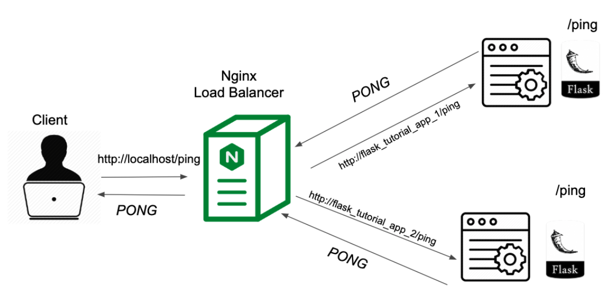

To streamline the deployment process, we aim to initiate all services, such as Flask and Nginx, with a single command. To achieve this, we have adopted a **container-based approach**, encapsulating each component within its own isolated container. The resulting system architecture is outlined below:

<p align="center">
    </img>
</p>

In the context of machine learning, we need to **distribute the computational workload across multiple machines**, which we've implemented using containers. 

Nginx is employed as a **load balancer** to direct traffic to these machines. Each node in our setup comprises an Nginx container and an application server container (hosting the model endpoint), and the entire network is orchestrated using **Docker Compose**.

## System Architecture

We simply implemented the above system architecture by the following **docker-compose** file:

```yaml
version: '0.2'
services:
    my_load_balance:
        build: nginx
        ports:
            - "80:80"
        depends_on:
            - model_endpoint1
            - model_endpoint2
    model_endpoint1:
        build: ../01_build_model_endpoint_by_flask
    model_endpoint2:
        build: ../01_build_model_endpoint_by_flask
networks:
  my_network:
    driver: bridge
```

The service system is constructed with Docker Compose. Leveraging the `model_endpoint` configurations from `01_build_model_endpoint_by_flask`, we expose port 80 as the system's sole external access point. 

Nginx serves as the front-end, **routing incoming traffic via the container's internal network (bridge)** to the designated model service based on custom configurations.

## Nginx Conf (Load Balance)

As the following shown, we utilize two services, `model_endpoint1` and `model_endpoint2`, and direct traffic to them through port `80`. **Without any specific load balancing configuration, traffic is evenly distributed.** To adjust traffic distribution, we can utilize the `weight` parameter to assign different weights to different machines.


```
events {}
http{
    upstream my_model_endpoint {
        server model_endpoint1:5001;
        server model_endpoint2:5001;
    }
    server {
        listen 80;

        location / {
            proxy_pass http://my_model_endpoint;
            proxy_set_header Host $host;
            proxy_set_header X-Real-IP $remote_addr;
            proxy_set_header X-Forwarded-For $proxy_add_x_forwarded_for;
            proxy_set_header X-Forwarded-Proto $scheme;
        }
    }
}
```

It's worth noting that both services listen on port `5001`, but this **doesn't cause any conflict**. Since Docker containers are **isolated environments**, it's like having **two separate machines, each running a service on port 5001.** 

Furthermore, neither `Dockerfile` explicitly defines a port mapping to the host machine, preventing external traffic from directly accessing the model services. Therefore, **Nginx is essential for routing traffic internally to the model services.**

## Launch Services

Finally, we can simply combine the configuration files we've created using the following command.

```bash
docker-compose up
```