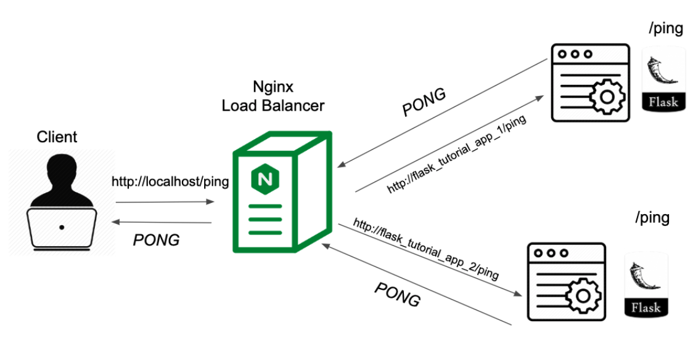

To streamline the deployment process, we aim to initiate all services, such as Flask and Nginx, with a single command. To achieve this, we have adopted a **container-based approach**, encapsulating each component within its own isolated container. The resulting system architecture is outlined below:

    </img>

In the context of machine learning, we need to **distribute the computational workload across multiple machines**, which we've implemented using containers. 

Nginx is employed as a **load balancer** to direct traffic to these machines. Each node in our setup comprises an Nginx container and an application server container (hosting the model endpoint), and the entire network is orchestrated using **Docker Compose**.

