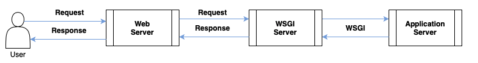

The Flask API, while suitable for many use cases, may exhibit performance bottlenecks under high traffic loads. To address this limitation and construct a more robust web server, we propose incorporating Nginx and WSGI. By positioning Nginx as a reverse proxy in front of our existing application server (model endpoint), we can distribute incoming traffic more efficiently and improve overall system performance.

    </img>

### Reference:
1. https://minglunwu.com/notes/2021/flask_plus_wsgi.html/
